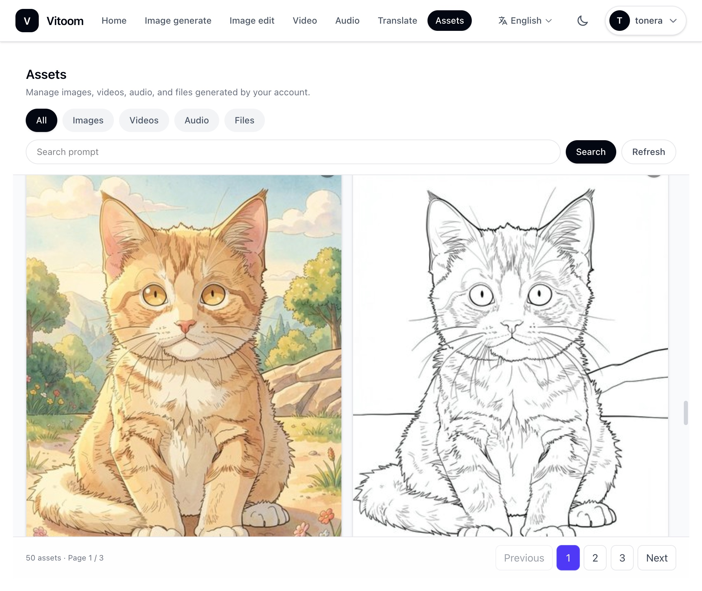

# Vitoom

[English](README.md) | [中文](README_CN.md) | **日本語**

Vitoom は **ローカル導入型の AIGC アプリケーションプラットフォーム** です。ブラウザからアクセスし、お使いの PC（DGX Spark / RTX Spark、RTX 30/40/50 シリーズ GPU 搭載マシン）上でテキスト・画像・音声・動画の推論を実行できます。内蔵 **AI Agent** が、執筆・翻訳・ドキュメント処理・ナレッジベース検索・マルチモーダル生成などを統合的に扱います。個人利用や LAN 上の小規模チーム向けです。機密性が高く、データを公開できずクラウド LLM も使えない場合に適しています。



## 主な用途

| 分野 | 説明 |
| --- | --- |
| 執筆・オフィス | 文書・レポート・要約；文案のブレスト；会話内容の Markdown / PDF エクスポート |
| ナレッジベース | PDF・Word・PPT などの保管；意味検索と Q&A；専用ナレッジの蓄積 |
| 音声・有声コンテンツ | 音声合成（複数話者・声質設計・クローン）；複数キャラの台詞／ラジオドラマ風配音；音声の文字起こし |
| 画像・動画 | テキストから画像（主要 OSS モデル対応）、画像編集；画像の理解・質問応答；テキスト／画像から動画 |
| ドキュメント・OCR | Web / PDF / Office リンクの要約・変換；スキャン OCR（表・数式）；表の Excel 出力 |
| 翻訳 | 長文の多言語翻訳；画像内テキストの翻訳 |
| Web 検索 | 任意のリアルタイム検索（Tavily API Key が必要） |

## 動作環境

- **Docker** と **Docker Compose**（`docker compose` サブコマンド）
- **推論環境**：**NVIDIA GPU**、**CUDA 13.0 対応の NVIDIA ドライバ**（`cu130` 推論イメージと一致；`nvidia-smi` で確認）、**NVIDIA Container Toolkit**（Linux ネイティブ、または Windows では Docker Desktop + WSL2）
- インストールスクリプト用 **Python 3.10+**（`scripts/` の設定とモデル取得のみ。ホストに推論環境全体は不要）
- イメージ／重み取得時に各ソースへ到達可能であること（セットアップで **中国本土** を選ぶと国内ミラーと ModelScope を優先；**その他** は主に Docker Hub / Hugging Face）

**プラットフォーム**

| プラットフォーム | 説明 |
| --- | --- |
| Linux | ネイティブ Docker を推奨；リポジトリルートで以下を実行 |
| Windows | [Docker Desktop](https://www.docker.com/products/docker-desktop/) + **WSL2**；GPU とプロジェクトディスクの **File Sharing** を有効化；**Python スクリプトと `docker compose` は同一環境で実行**（WSL2 ターミナルか PowerShell のどちらかに統一） |

GPU / CUDA 13.0 ランタイム確認（任意。Docker と GPU パススルーが有効な場合）：

```bash
docker run --rm --gpus all nvidia/cuda:13.0.0-base-ubuntu24.04 nvidia-smi
```

## Windows 環境準備

Windows ユーザーは、先に以下の準備を完了してください。準備段階のコマンドはすべて **PowerShell** で実行します。以降のインストール手順も同じ環境で続けることを推奨します。PowerShell と WSL ターミナルを途中で混在させると、パスの不一致が起きやすくなります。

**1. PowerShell を開く**

スタートメニューで **PowerShell** を検索して開き、まず WSL が利用できるか確認します：

```powershell
wsl --version
wsl -l -v
```

`wsl -l -v` の出力にある `VERSION` 列を確認してください。使用する Linux ディストリビューションは `2` である必要があります。`1` と表示される場合は、以下のコマンドで WSL2 に切り替えます：

```powershell
wsl --set-default-version 2
wsl --set-version <ディストリビューション名> 2
```

`<ディストリビューション名>` は `wsl -l -v` に表示された名前に置き換えてください。例：`Ubuntu`。

**2. Git をインストール**

Git は Vitoom のソースコードをダウンロードするために必要です。Git がないと、後続の `git clone` コマンドが失敗します。

```powershell
winget install --id Git.Git -e --source winget
```

**3. Python 3.11 をインストール**

Python は `scripts/` 配下のセットアップウィザードとダウンロードスクリプトを実行するために必要です。

```powershell
winget install --id Python.Python.3.11 -e --source winget
```

**4. PowerShell を開き直す**

Git と Python のインストール後、現在の PowerShell を閉じて、新しい PowerShell を開いてください。その後、以下のコマンドでインストールを確認します：

```powershell
git --version
py -3 --version
docker compose version
```

すべてのコマンドでバージョン情報が表示されれば、次の「クイックインストール」に進んでください。

## クイックインストール

まずプロジェクトコードを取得し、プロジェクトディレクトリに入ってからインストールコマンドを実行します。Windows ユーザーは、先ほど開き直した **PowerShell** で続けることを推奨します。

**1. プロジェクトコードをクローン**

```bash
git clone https://github.com/tonera/vitoom.git
cd vitoom
```

**2. 環境の設定**

セットアップウィザードが `.env` を生成し、CPU アーキテクチャ `x86_64` / `aarch64` を検出し、推論用に LAN アドレスを書き込みます。設定時の注意：**`VITOOM_BACKEND_URL` に `127.0.0.1` を設定しないでください**。コンテナ内の推論サービスから Backend に接続できません。

```bash
python scripts/setup_vitoom.py
```

Windows PowerShell で `python` が見つからない場合は、以降の `python` で始まるコマンドを `py -3` に置き換えてください。例：

```powershell
py -3 scripts/setup_vitoom.py
```

**3. イメージの取得**

```bash
python scripts/load_vitoom_images.py
```

`images/<アーキテクチャ>/` のオフライン tar を優先し、なければ Docker Hub から pull。一部のみの例：

```bash
python scripts/load_vitoom_images.py --components backend,visual,text
```

**4. サービスの起動**

**Backend を先に**起動（Docker ネットワーク `vitoom-net` を作成）してから推論コンテナを起動：

```bash
docker compose up -d backend
```

ウィザードで選んだコンポーネントの profile を起動（よく使う一式。**1 行で記述**。Windows CMD は `\` による行継続不可）：

```bash
docker compose -f docker-compose.inference.release.yml --profile visual --profile text --profile audio --profile mini --profile download up -d
```

一部のみの例（画像とテキスト）：

```bash
docker compose -f docker-compose.inference.release.yml --profile visual --profile text up -d
```

ブラウザ：`http://<LANのIP>:8888`（`.env` の `VITOOM_BACKEND_URL` / `VITOOM_SERVER_PORT` を参照。ブラウザは `127.0.0.1` でもよいが、`.env` は LAN IP のままにしてください）。

**5. モデルのダウンロード（任意・容量大）**

```bash
python scripts/download_initial_models.py
```

後から Web の **モデル管理** からも取得可能（`download` profile が必要）。初回は Backend と Text を起動し、対応する LLM を取得することを推奨。

詳細は [`docker-usage-jp.md`](docker-usage-jp.md) を参照（[English](docker-usage-en.md) / [中文](docker-usage-cn.md)）。

## 使い方

1. **ログイン**：ブラウザで `http://<LANのIP>:8888` を開きます。初回デプロイ後の管理者は `admin@vitoom.ai`、パスワードは `.env` の `DEFAULT_ADMIN_PASSWORD` です。追加ユーザーは管理者が Web のユーザー管理から作成できます。
2. **Agent**：自然言語で執筆・翻訳・ドキュメント・ナレッジベース・画像／音声／動画生成（ツールは自動選択）。
3. **ワークスペース**：ホームから **画像生成**・**動画生成**・**音声**（ASR/TTS）・**翻訳** など。
4. **モデル管理**：一覧からダウンロード・有効化；`download` profile または手順 5 のスクリプトが必要。
5. **ナレッジベース**：ファイルや会話をアーカイブ後、Agent で検索。
6. **Web 検索（任意）**：`.env` に `TAVILY_API_KEY` を設定（[Tavily](https://www.tavily.com/)）。

推論の初回起動は重み読み込みのため時間がかかることがあります。ログ：

```bash
docker compose logs -f backend
docker compose -f docker-compose.inference.release.yml logs -f visual
```

## 関連ドキュメント

| ドキュメント | 説明 |
| --- | --- |
| [`docker-usage-jp.md`](docker-usage-jp.md) | Docker デプロイ（日本語） |
| [`docker-usage-en.md`](docker-usage-en.md) | Docker デプロイ（英語） |
| [`docker-usage-cn.md`](docker-usage-cn.md) | Docker デプロイ（中国語） |

## 謝辞

- [TurboDiffusion](https://github.com/thu-ml/TurboDiffusion) — 動画推論の高速化
- [Nunchaku](https://github.com/nunchaku-ai/nunchaku) — 画像推論の加速
- [Qwen3-TTS](https://github.com/QwenLM/Qwen3-TTS) — 音声合成
- [Qwen3-ASR](https://github.com/QwenLM/Qwen3-asr) — 音声認識
- [VoxCPM](https://voxcpm.readthedocs.io/) — 高速音声合成
- [vLLM](https://github.com/vllm-project/vllm) — テキスト推論エンジン
- [RMBG-2.0](https://github.com/Bria-AI/RMBG-2.0) — 背景除去
- [MeanCache](https://github.com/UnicomAI/MeanCache) — 画像推論の加速

## ライセンス

本プロジェクトは [GNU Affero General Public License v3.0](LICENSE)（AGPL-3.0）です。商用ライセンスは [COMMERCIAL_LICENSE.md](COMMERCIAL_LICENSE.md) を参照（該当する場合）。

各推論モデルおよび第三者コンポーネントは上流のライセンスに従います。利用前にコンプライアンスをご確認ください。
