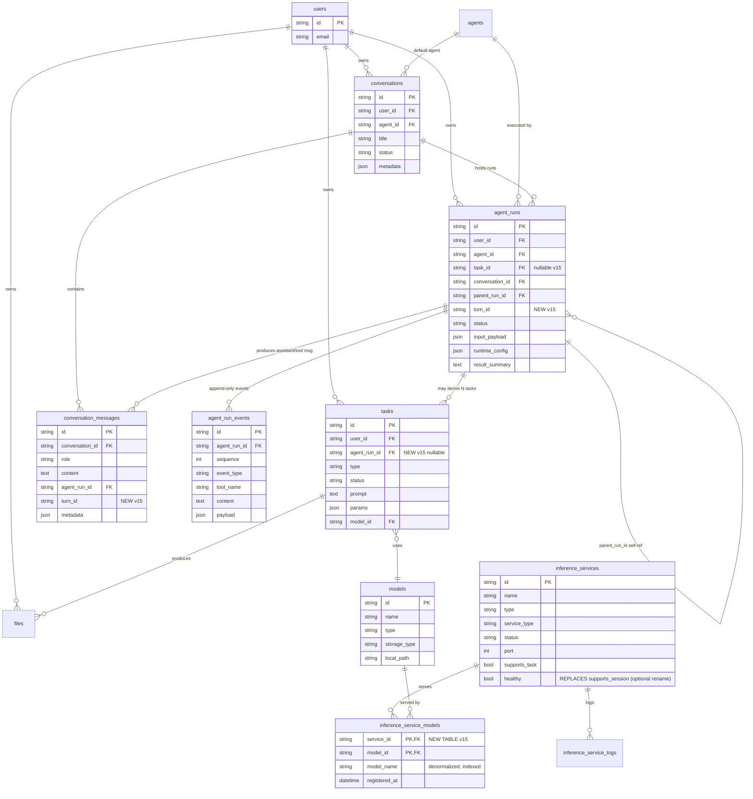

# 统一会话重构 DB 结构 v15

本文件是 Phase 1 设计产物（P1-1），作为 `.cursor/plans/统一会话重构_63361fab.plan.md` §1.A 与 §6 的落地级 ER 图与 DDL 增量，Review 通过后进入 Phase 2 编码。

> 来源映射：
> - 统一会话领域模型、字段级映射：主文档 §1.A
> - 推理服务能力路由改造：主文档 §6.2 / §6.3
> - 迁移脚本 drift 修复：主文档「风险 7」

## 0. 版本与范围

- 当前 DB 结构版本：v14（见 `backend/database/migrations.py:115`，`target_version = 14`；`check_migration_needed()` 中 `target_version = 9` 为 drift，本次修复）。
- 目标 DB 结构版本：**v15**（本次重构唯一一次破坏性 schema 变更）。
- 设计原则：**能复用就复用**，不新建"chat_sessions / chat_messages"平行表；旧实时会话表被整表删除。
- 首版冻结的字段集 = "最小必要迁移集"；`mode / default_input_mode / bound_services` **不作为首版字段**（待 PoC 证明后再上）。

## 1. ER 全景（v15）



**被整表删除的表**：`sessions`（旧实时会话表）。

**被删除的列**：
- `inference_services.capabilities`（JSON 字符串数组）
- `inference_services.supports_session`（Boolean）

**被放松约束的列**：
- `agent_runs.task_id`：`NOT NULL` → `NULL`（语义见 §2.3）

**新增列**：
- `conversation_messages.turn_id`（`VARCHAR(36) NULL`，索引）
- `agent_runs.turn_id`（`VARCHAR(36) NULL`，索引）
- `tasks.agent_run_id`（`VARCHAR(36) NULL`，外键 → `agent_runs.id`，索引）

**新增表**：
- `inference_service_models`（见 §3）

## 2. 领域映射与 DDL 增量

### 2.1 `ChatSession` ← `conversations`

**复用现有表**，首版不扩字段。`Conversation.status` 保持粗粒度（`active / closed / failed`）；运行态（`opening / ready / streaming_output / waiting_task / interrupted / ...`）仅存在于 `SessionRuntime` 内存与 `agent_run_events` 事件流，不落 `conversations.status`。

**暂不加入 v15 的候选列**（PoC 后再议）：`mode / default_input_mode / bound_services`。理由见主文档 §1.A.1。

**DDL 增量**：无。

### 2.2 `ChatMessage` ← `conversation_messages`

**复用现有表 + 新增 `turn_id`**。文字/音频/工具/系统消息全部走此表，通过 `role`（`user / assistant / tool / system`）区分；`input_mode / output_mode` 写入 `message_metadata`（JSON），不新增独立列。

**DDL 增量**：

```sql
ALTER TABLE conversation_messages
    ADD COLUMN turn_id VARCHAR(36) NULL;

CREATE INDEX idx_conversation_messages_turn_id
    ON conversation_messages (turn_id);
```

### 2.3 `SessionRun` ← `agent_runs`

**关键决策**：
1. **放宽 `task_id NOT NULL`**：统一会话里同步 Run 不派生 Task 时 `task_id` 保持为 `NULL`；仅当 Master Agent 触发图片/视频/TTS 等生成型工具时，才派生一个或多个子 Task。
2. **新增 `turn_id`**：与 `conversation_messages.turn_id` 对齐，支持"一个 Turn 对应一个 Run"的反查。
3. **多 Task 场景**：`agent_runs.task_id` 不再承担 "N Tasks" 的承载；改由 `tasks.agent_run_id` 反查。
4. **status 取值扩展**（应用层约束，不靠数据库 CHECK）：
   - 现有：`created / pending / running / completed / failed / cancelled`（见 `backend/services/agent/service.py` 等处）
   - 新增语义：`reasoning / tool_running / streaming_output / waiting_task / interrupted`
   - 首版建议在 ORM/服务层维护取值白名单，DDL 不加 `CHECK`（保留灰度空间）。

**DDL 增量**：

```sql
ALTER TABLE agent_runs
    ALTER COLUMN task_id DROP NOT NULL;

ALTER TABLE agent_runs
    ADD COLUMN turn_id VARCHAR(36) NULL;

CREATE INDEX idx_agent_runs_turn_id
    ON agent_runs (turn_id);
```

> SQLite 注意：SQLite 不支持 `ALTER COLUMN ... DROP NOT NULL`，需用"建新表 + copy + drop old + rename"模式，详见 §5。

### 2.4 `SessionEvent` ← `agent_run_events`

**首版不新建表**。扩展方式：
- 事件所属 `session_id`：从 `agent_runs.conversation_id` 反查，不在 events 表上冗余。
- 事件所属 `turn_id`：写入 `payload.turn_id`。
- WS 广播：按 `conversation_id` 聚合事件流，与 `/ws/chat/{session_id}` 层解耦（事件落库仍按 run_id 组织）。

**DDL 增量**：无。

### 2.5 `ToolInvocation`

**首版不新建表**。复用现有三类事件：`tool_call_started / tool_call_completed / tool_call_failed`（由 `backend/services/agent/events.py` 产生）。未来做工具级强审计统计时，再独立抽表。

### 2.6 `Turn`

**首版不新建表**，纯运行时概念。规范：
- `turn_id = uuid4()`，由后端在 Turn 开始时生成（第一次 `user_message / audio_chunk` 到达）。
- 完成判据见状态机文档 §D.2。
- 持久化体现为 `conversation_messages.turn_id == agent_runs.turn_id == payload.turn_id`（值相等即关联，不建表级外键）。

### 2.7 `Task` 的角色降级

`Task` 从"主入口模型"降级为"从 `SessionRun` 派生的长耗时子任务"。新增反查关系：

```sql
ALTER TABLE tasks
    ADD COLUMN agent_run_id VARCHAR(36) NULL
        REFERENCES agent_runs(id);

CREATE INDEX idx_tasks_agent_run_id
    ON tasks (agent_run_id);
```

**映射规则**：
- `AgentRun.task_id`（保留但可空）：若只派生单个 Task，填首个 Task.id（便于兼容现有代码路径）。
- `tasks.agent_run_id`：所有派生出的 Task 都写回此字段，`1 Run → N Tasks` 通过此字段反查。

## 3. 推理服务能力路由改造（§6）

### 3.1 删除列

```sql
ALTER TABLE inference_services
    DROP COLUMN capabilities;

ALTER TABLE inference_services
    DROP COLUMN supports_session;
```

### 3.2 保留或重命名 `supports_task`

**决策（待 Review）**：
- **方案 A（推荐）**：保留 `supports_task`，不改名；语义从"能否接任务"扩展为"当前是否接受派发"（与模型无关）。
- **方案 B**：改名为 `healthy` 或 `accepting_requests`。

Phase 1 冻结为**方案 A**：`supports_task` 保留原名，语义默认收敛为"健康/接受派发"。

### 3.3 ~~新增关联表 `inference_service_models`~~（**v16 已废弃**）

> **纠偏（v16）**：本节描述的 `inference_service_models` 已在 v16 迁移里 `DROP`，相关 ORM 类、路由逻辑、推理端 `service_register.models` 上报点全部回滚。
>
> 新的分工：
>
> - `load_name` 是**会话 / 请求层**参数，由 `ChatSession.metadata.load_name`（由 `POST /v1/chat/sessions` 写入；缺省读 `config/default.yaml:agents.default_model`）或每条 `session_text_input` 消息携带；
> - 后端 `ModelNameRouter` 只按 `inference_services.service_type`（`text` / `audio`）做分类调度，选一个 `status=running` 的服务即可；
> - 具体"能不能跑这个 `load_name`"由推理端校验，报错以 `session_error` 回流、后端映射为 `model_not_available`。
>
> 以下原始设计保留仅作历史参考。

一个推理服务可同时加载多个模型；一个模型可被多个服务同时 serve。多对多关系显式化。

```sql
CREATE TABLE inference_service_models (
    service_id    VARCHAR(36) NOT NULL
                  REFERENCES inference_services(id) ON DELETE CASCADE,
    model_id      VARCHAR(36) NOT NULL
                  REFERENCES models(id) ON DELETE CASCADE,
    model_name    VARCHAR(255) NOT NULL,
    registered_at DATETIME NOT NULL,
    PRIMARY KEY (service_id, model_id)
);

CREATE INDEX idx_ism_model_name
    ON inference_service_models (model_name);

CREATE INDEX idx_ism_service_id
    ON inference_service_models (service_id);
```

**字段说明**：
- `service_id / model_id`：复合主键。
- `model_name`：冗余保存 `models.name`（或 `get_by_full_name` 的展示名），用于**按 model_name 精确路由**时避免连表；允许 `model_name` 在多服务中重复。
- `registered_at`：本次 `service_register` 上报时间；重复 register 时 `UPSERT`。

### 3.4 路由契约

- **生产侧（推理服务）**：`service_register` 消息新增字段 `models: [{"name": "...", "id": "..."}]`；后端按 `(service_id, model_id)` `UPSERT` 进 `inference_service_models`。
- **消费侧（后端）**：`ModelNameRouter.pick(model_name) → service_id`：
  ```sql
  SELECT s.id
  FROM inference_services s
  JOIN inference_service_models ism ON ism.service_id = s.id
  WHERE ism.model_name = :model_name
    AND s.status = 'running'
    AND s.supports_task = TRUE
  ORDER BY s.last_heartbeat_at DESC
  LIMIT 1;
  ```
- 匹配失败时返回 `error{code=model_not_available}`（WS 协议见 chat_ws_protocol.md）。

### 3.5 历史数据清理

v14 → v15 迁移不保留旧实时会话表 / `capabilities` / `supports_session` 历史数据（见主文档"决策 2"破坏性迁移）：
- 会话类历史数据（`sessions` 表）直接丢弃。
- `capabilities` 字段丢弃；`supports_session` 字段丢弃。
- `inference_service_models` 从空表开始，后续由推理服务注册时上报填充。

## 4. 迁移脚本增量（v14 → v15）

在 `backend/database/migrations.py` 中新增 `migrate_v14_to_v15()`：

```python
def migrate_v14_to_v15(engine) -> None:
    """v15: 统一会话重构 - 最小必要 schema 变更。

    - DROP TABLE sessions（旧实时会话表）
    - ALTER agent_runs: task_id NULL; ADD COLUMN turn_id
    - ALTER conversation_messages: ADD COLUMN turn_id
    - ALTER tasks: ADD COLUMN agent_run_id
    - ALTER inference_services: DROP capabilities, DROP supports_session
    - CREATE TABLE inference_service_models
    """
    inspector = inspect(engine)
    with engine.connect() as conn:
        # 1) 删除 sessions 表（破坏性）
        if "sessions" in inspector.get_table_names():
            conn.execute(text("DROP TABLE sessions"))
            logger.info("v15: dropped table `sessions`")

        # 2) agent_runs: task_id DROP NOT NULL + ADD turn_id
        _drop_not_null(conn, "agent_runs", "task_id")   # 方言分支
        if "turn_id" not in _columns(inspector, "agent_runs"):
            conn.execute(text("ALTER TABLE agent_runs ADD COLUMN turn_id VARCHAR(36) NULL"))
            conn.execute(text("CREATE INDEX idx_agent_runs_turn_id ON agent_runs (turn_id)"))

        # 3) conversation_messages: ADD turn_id
        if "turn_id" not in _columns(inspector, "conversation_messages"):
            conn.execute(text(
                "ALTER TABLE conversation_messages ADD COLUMN turn_id VARCHAR(36) NULL"
            ))
            conn.execute(text(
                "CREATE INDEX idx_conversation_messages_turn_id ON conversation_messages (turn_id)"
            ))

        # 4) tasks: ADD agent_run_id
        if "agent_run_id" not in _columns(inspector, "tasks"):
            conn.execute(text(
                "ALTER TABLE tasks ADD COLUMN agent_run_id VARCHAR(36) NULL"
            ))
            conn.execute(text("CREATE INDEX idx_tasks_agent_run_id ON tasks (agent_run_id)"))

        # 5) inference_services: 删列
        for col in ("capabilities", "supports_session"):
            if col in _columns(inspector, "inference_services"):
                _drop_column(conn, "inference_services", col)   # 方言分支

        # 6) 新表 inference_service_models
        if "inference_service_models" not in inspector.get_table_names():
            conn.execute(text(
                """
                CREATE TABLE inference_service_models (
                    service_id    VARCHAR(36) NOT NULL,
                    model_id      VARCHAR(36) NOT NULL,
                    model_name    VARCHAR(255) NOT NULL,
                    registered_at DATETIME NOT NULL,
                    PRIMARY KEY (service_id, model_id)
                )
                """
            ))
            conn.execute(text("CREATE INDEX idx_ism_model_name ON inference_service_models (model_name)"))
            conn.execute(text("CREATE INDEX idx_ism_service_id ON inference_service_models (service_id)"))

        conn.commit()

    set_current_version(15)
```

**配套修复**：`migrate()` 内 `target_version` 与 `check_migration_needed()` 内 `target_version` 都改为 `15`，消除主文档风险 7 指出的 drift。

### 4.1 SQLite 方言分支说明

SQLite 不支持 `ALTER TABLE ... DROP COLUMN`（3.35 以下）与 `ALTER COLUMN ... DROP NOT NULL`。`_drop_not_null / _drop_column` 辅助函数需实现：

1. `PRAGMA foreign_keys=OFF`
2. `CREATE TABLE <new>` with new schema
3. `INSERT INTO <new> SELECT ... FROM <old>`
4. `DROP TABLE <old>`
5. `ALTER TABLE <new> RENAME TO <old>`
6. 重建索引
7. `PRAGMA foreign_keys=ON`

Postgres / MySQL 直接用 `ALTER TABLE` 即可。

## 5. 与现有代码的冲突点（Phase 2 需同步处理）

本节不产出代码，仅列明 Phase 2 必须同步修改的代码位置，供 Review 确认范围。

| 代码位置 | 冲突点 |
|---|---|
| `backend/database/models.py` 旧实时会话 ORM 类 | 整类删除 |
| `backend/database/models.py` `User.sessions` 关系 | 删除对应旧实时会话关系 |
| `backend/database/models.py` `AgentRun.task_id` | `nullable=True`；`AgentRun.create()` 签名移除 `task_id` 必填 |
| `backend/database/models.py` `InferenceService` | 删 `capabilities / supports_session` 列；新增 ORM 类 `InferenceServiceModel` |
| `backend/database/models.py` `Conversation / ConversationMessage / AgentRun` | 新增 `turn_id` 字段 |
| `backend/database/models.py` `Task` | 新增 `agent_run_id` 字段 |
| `backend/services/session/service.py` 旧会话选服管理器 | 依赖 `capabilities / supports_session`，全量重写为 `ModelNameRouter`（Phase 2/4 替换） |
| `backend/api/sessions/routes.py` | 依赖旧实时会话 CRUD，Phase 5 下线 |
| `backend/websocket/routes.py` | 依赖旧实时会话，Phase 2 新增 `/ws/chat`，Phase 5 下线旧实时 WS 路径 |
| `backend/services/inference/service.py` `sync_service_registration` | 签名移除 `capabilities / supports_session`；改为接收 `models: List[...]`，写入 `inference_service_models` |
| `backend/workers/agent_worker.py` | 删除"Task 必须存在"的强依赖 |
| `inference/config/*.yaml` 中旧场景字段 | Phase 3 删除；v15 迁移本身不触碰配置文件 |

## 6. 验收清单

Phase 1 本文件 Review 通过的判定标准：

- [ ] 图中所有关系线与 §2 的 DDL 增量一一对应，无遗漏字段。
- [ ] 旧实时会话表被明确整表删除；`sessions` 中旧场景字段不迁移。
- [ ] `agent_runs.task_id` 放宽为可空，新语义在 §2.3 描述完整。
- [ ] `turn_id` 在 `conversation_messages / agent_runs` 上都有新增，且 §2.6 明确为值对齐而非表级外键。
- [ ] `tasks.agent_run_id` 明确为"一 Run 派生 N Task"的反查键。
- [ ] `inference_services.capabilities / supports_session` 明确删除；`inference_service_models` 关联表结构冻结。
- [ ] 迁移脚本 drift（`check_migration_needed` 的 `target_version`）修复为 `15`。
- [ ] `mode / default_input_mode / bound_services` 明确不在 v15 首版迁移范围内。
